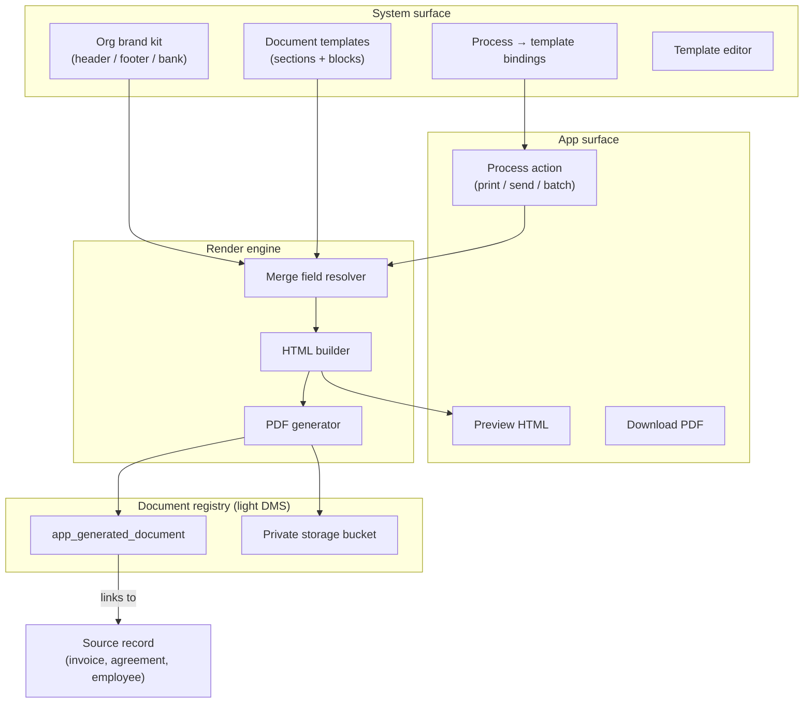

# 01 — Approach and architecture

## Problem statement

NDIS providers produce a high volume of regulated documents: tax invoices, service agreements, employee contracts, incident letters, and batch outputs at month-end. Today AbilityVua:

- Hard-codes invoice layout in TypeScript (`invoice-print.ts`)
- Has no printable service agreement output (e-sign captures signature only)
- Stores employee “contracts” as external URLs, not generated documents
- Uses **public** storage buckets unsuitable for invoices and HR files
- Has no way to assign “which template” runs when a user executes a process

Operators need a **System-managed** template library with consistent **org header/footer**, an **editor** for authorised roles, **single and batch** output, and **PDF export** — without building a full document management product.

---

## Design principles

1. **Org brand is single source of truth** — header, footer, ABN, NDIS registration, bank details, payment terms come from org profile extensions, not duplicated per template.
2. **Templates are data, not code** — default scaffolds ship in seed/migration; operators edit in System.
3. **Records stay authoritative** — invoice/agreement/employee records remain source data; documents are rendered views + archived copies.
4. **Process-driven** — every print/send/batch action runs through a catalog process with optional template override.
5. **Compliance by template type** — each template declares its document class (tax invoice, agreement, HR contract) and required merge fields are enforced at render time.
6. **Audit everything** — template saves, renders, PDF generation, and sends log to audit trail and optional process audit.

---

## Platform components



### 1. Org brand kit (extends `app_organization`)

Add a **Document branding** section to organisation profile (System → Organisation):

| Field group | Examples | Used in |
|-------------|----------|---------|
| Letterhead | Logo upload (not URL-only), trading name, legal name, address | All documents |
| Identifiers | ABN, NDIS registration number | Invoices, agreements |
| Contact | Phone, email, website | Header / footer |
| Payment | BSB, account number, account name, remittance email | Invoices |
| Footer boilerplate | “GST-free under NDIS…”, privacy line, complaints contact | Footer block |
| Document defaults | Date format (DD/MM/YYYY), currency (AUD), page size (A4) | Render engine |

**Logo upload:** new private `org-assets` bucket (or path under `org-documents`) with signed URL for render — replaces fragile external `logoUrl` for documents.

### 2. Document template model

Mirror **board report templates** but oriented to merge fields and layout blocks.

**Tables (proposed):**

| Table | Purpose |
|-------|---------|
| `app_document_template` | Template header: name, document class, active, default for class, version |
| `app_document_template_block` | Ordered blocks: type, content HTML/markdown, visibility rules |
| `app_document_template_field` | Declares required merge fields for validation |
| `app_process_document_binding` | Maps `process_id` + optional entity scope → `template_id` |

**Block types (v1):**

| Block type | Editable? | Notes |
|------------|-----------|-------|
| `org-header` | Locked layout, org fields only | Logo, name, ABN, address |
| `org-footer` | Locked layout | Page numbers, footer text |
| `title` | Yes | e.g. “Tax Invoice”, “Employment Agreement” |
| `parties` | Partial | Bill-to / participant / employee merge blocks |
| `line-table` | Schema-driven | Invoice lines, schedule lines — not freeform HTML |
| `rich-text` | Yes | Clauses (agreements, contracts) — legal review required |
| `signature` | Partial | Signer lines, e-sign image placeholder |
| `totals` | Schema-driven | Invoice totals, GST breakdown |
| `spacer` | Yes | Layout control |

**Merge field syntax:** `{{invoice.documentNo}}`, `{{client.name}}`, `{{org.abn}}` — same pattern as task automations (`engine.ts`).

**Template editor UX (v1 — “easy editor”, not Word):**

- Split view: block list (drag reorder) + WYSIWYG preview with sample record
- Merge field picker inserts tokens into rich-text blocks
- Locked blocks show “Organisation header — edit in Organisation profile”
- Validation panel: missing required fields for document class
- Version note on save; optional “publish” vs “draft template”

**Access:** System window `admin-document-templates` (Write = create/edit). App users only **consume** templates via processes.

### 3. Process → template binding

Extend catalog processes with document outputs:

```typescript
// Conceptual — lives in DB + admin UI
{
  processId: "print-invoice",
  entityType: "invoice",
  templateId: "dtax-invoice-ndis-v1",
  isDefault: true,
  allowUserOverride: true, // picker on print dialog if user has write
}
```

**Processes needing bindings (v1 pack):**

| Process | Entity | Output |
|---------|--------|--------|
| `print-invoice` | invoice | Single PDF / print |
| `batch-print-invoices` | invoice (set) | ZIP or multi-file PDF |
| `send-invoice` | invoice | PDF + email hook (future) |
| `print-service-agreement` | service-agreement | Agreement PDF |
| `print-employee-contract` | employee | Contract PDF |
| `generate-board-report` | board-report-pack | Already exists — migrate to template system later |

**User experience:**

1. User clicks **Print invoice** on invoice record (existing process check).
2. Dialog shows template dropdown (default from binding; list filtered by document class).
3. Preview → Print or Download PDF.
4. Optional: “Save copy to document registry” (on by default for batch).

Register new processes in `catalog.ts`, `docs/processes/`, and seed access for finance/admin roles.

### 4. Render pipeline

**Phase A — HTML (reuse existing pattern)**

1. Load template blocks + org brand + source record (+ lines, client, etc.).
2. Resolve merge fields → `AutomationTemplateContext`-style context per entity.
3. `buildDocumentHtml(ctx)` → full HTML document with inline CSS + `@media print`.
4. `window.open` + print OR in-app preview iframe.

**Phase B — PDF**

Options evaluated:

| Option | Pros | Cons |
|--------|------|------|
| Browser print → “Save as PDF” | Zero infra | Not batch-safe; inconsistent |
| `@react-pdf/renderer` | Structured PDF; no headless browser | Rebuild layouts; weak HTML fidelity |
| Headless Chromium (Playwright/Puppeteer) | HTML fidelity; reuse templates | Lambda/Amplify sizing; ops cost |
| Third-party (DocRaptor, PDFShift) | Fast to ship | Cost; data leaves tenant |

**Recommendation:**

- **Stage 1–2:** HTML print (parity with today, template-driven)
- **Stage 3:** Server route `POST /api/documents/render-pdf` using **Playwright in a container** or **Supabase Edge + chromium** for batch
- Store output in private bucket; return signed download URL (1-hour TTL)

Batch invoices: queue job renders N PDFs → ZIP → registry entries with shared `batch_id`.

### 5. Document registry — do we need a DMS?

**Answer: yes for generated artifacts; no for a full ECM product.**

| Need | Full DMS | Document registry (recommended) |
|------|----------|--------------------------------|
| Store generated PDFs | Yes | Yes |
| Link to invoice/agreement/employee | Yes | Yes |
| Version history | Yes | Template version + generated doc version |
| Full-text search | Often | Phase 2+ (metadata search first) |
| Workflow / approvals | Often | Use existing task/process audit |
| Retention / legal hold | Yes | Align with `record-retention` settings |
| Folders / taxonomy | Yes | Flat + tags + entity link (simpler) |

**Proposed table `app_generated_document`:**

| Column | Purpose |
|--------|---------|
| `id`, `document_no` | Registry identity |
| `template_id`, `template_version` | Which template produced it |
| `entity_type`, `entity_id` | Source record |
| `document_class` | invoice, agreement, hr-contract, … |
| `storage_path`, `file_name`, `mime_type`, `byte_size` | Object storage |
| `batch_id` | Nullable — batch invoice run |
| `status` | draft / final / superseded |
| `generated_by`, `generated_at` | Audit |
| `sent_at`, `sent_to` | Optional delivery tracking |

**Private bucket `org-documents`:**

- Path: `{orgId}/{documentClass}/{entityId}/{timestamp}-{slug}.pdf`
- RLS: service role write; authenticated read via signed URL scoped to role/window
- **Not public** — unlike current incident/employee evidence buckets

**Relationship to attachments:**

| Storage | Use |
|---------|-----|
| Entity line tables (`employee_document`, incident evidence) | User-uploaded files |
| Document registry | System-generated PDFs from templates |
| Org assets | Logo, optional letterhead background |

My workplace **Contracts** tab can show registry-generated contracts plus uploaded URLs.

### 6. System admin surfaces (proposed)

All **System surface** (`surface: "system"` in catalog):

| Window | Purpose |
|--------|---------|
| `admin-document-templates` | List, edit, preview, activate templates |
| `admin-document-bindings` | Process → template mapping (could be tab on templates) |
| `admin-document-registry` | Search generated documents, re-download, retention status |
| Organisation profile (existing) | Brand kit fields |

Help guides + module setup checklist entries required per project rules.

### 7. Security and compliance

- Templates with HR/legal content: restrict Write to System admin + HR manager role template
- Generated PDFs: private bucket + signed URLs; log every download in process audit
- PII in batch jobs: run server-side only; no client-side batch PDF for 500 invoices
- Template export/import: JSON pack for staging → production (no executable content)
- Disclaimer on seeded legal blocks: “Scaffold only — obtain legal review”

### 8. What we are explicitly not building in v1

- Full WYSIWYG Word replacement with free-form pagination
- OCR / inbound document capture
- Participant e-sign on arbitrary PDFs (service agreement e-sign stays on structured record)
- Email delivery platform (hook points only; integrate SendGrid/SES later)
- SharePoint / Google Drive sync

---

## Decision log (for review)

| ID | Decision | Status |
|----|----------|--------|
| D1 | Lightweight document registry, not enterprise DMS | **Proposed** |
| D2 | Templates in DB; PDFs in private Supabase bucket | **Proposed** |
| D3 | Org header/footer locked; body blocks editable | **Proposed** |
| D4 | Process bindings with user override on print | **Proposed** |
| D5 | HTML first, server PDF second | **Proposed** |
| D6 | Legal text = seeded scaffolds; org responsible for review | **Proposed** |
| D7 | Migrate `invoice-print.ts` to template pack, not maintain parallel | **Proposed** |
