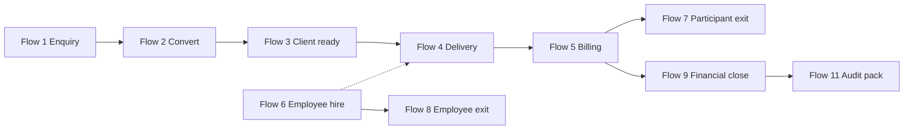

# AbilityVua Happy Path and End-to-End Testing Matrix

**Version:** 1.0 (enquiry → exit spine)  
**Last updated:** 2026-06-25  
**Environment:** Amplify demo (`https://app.abilityvua.com`) or localhost (`npm run dev`) with Supabase remote + demo seed unless noted.

## ID scheme

| Prefix | Range (this doc) | Use |
|--------|------------------|-----|
| HP | 001–120 | Happy path steps — flows 1–11 |
| FUNC | 100–499 | Functional checks — all modules |
| TEST | 001–099 | Executable test cases tied to HP rows |
| DATA | 001–019 | Seed / synthetic records |
| ROLE | 010–019 | Role-based browser suites |
| ISSUE | — | See [ISSUE-LOG-TEMPLATE.md](./ISSUE-LOG-TEMPLATE.md) |

**Build status legend:** **Live** = shippable in demo; **Partial** = UI or logic exists but incomplete vs scope; **Planned** = in roadmap / process doc only; **N/A** = out of AbilityVua scope.

## Table of contents

1. [Purpose and scope](#1-purpose-and-scope)
2. [Test environment and roles](#2-test-environment-and-roles)
3. [Core spine overview](#3-core-spine-overview)
4. [End-to-end happy path — flows 1–11](#4-end-to-end-happy-path--flows-111)
5. [Functional test matrix](#5-functional-test-matrix)
6. [Data and seed catalogue](#6-data-and-seed-catalogue)
7. [Role permission matrix](#7-role-permission-matrix)
8. [Issue log](#8-issue-log)
9. [Missing functions and gaps review](#9-missing-functions-and-gaps-review)
10. [Full UAT programme](#10-full-uat-programme)

**Full catalogue testing:** [UAT-INDEX.md](./UAT-INDEX.md) (all windows, processes, reports).

---

## 1. Purpose and scope

This matrix is the **demo-grade E2E contract** for AbilityVua: a single spine from **enquiry intake** through **service delivery and billing** to **participant and employee exit**, with linked FUNC rows, seed data IDs, and smoke TEST cases.

**In scope:** Routes in `web/src/lib/access/catalog.ts` (~108 app routes), Supabase-persisted records, audit footer + Full audit trail on saves, line tables on records.

**Out of scope (N/A in tables):** SCHADS payroll calculation in-app, live PRODA submission, participant portal / e-sign.

**How to use it**

1. Run chain smokes in order (§4 — AI browser instructions).
2. Log defects in [ISSUE-LOG-TEMPLATE.md](./ISSUE-LOG-TEMPLATE.md) with HP / FUNC / TEST IDs.
3. After each save, hard-refresh and confirm persistence.
4. Re-apply E2E seeds before retest when noted in §6.

---

## 2. Test environment and roles

| Item | Value |
|------|--------|
| **Amplify URL** | `https://app.abilityvua.com` |
| **Local** | `cd web && npm run dev` → `http://localhost:3000` |
| **DB** | Remote Supabase via `SUPABASE_DB_URL` |
| **Demo password** | `welcome` (staff); SuperUser uses `flamingo` |
| **June test window** | Rostering / timesheets: `?week=2026-06-09` (Mon 8 – Sun 14 June 2026) |

### Seed commands

| Command | Purpose |
|---------|---------|
| `npm run supabase:seed-e2e-intake` | Reset enquiry chain + `bp-e2e-exit` (flows 1–3, 7) |
| `npm run supabase:seed-e2e-amplify` | Bern agency claims + plan-managed invoice + publish shift (flows 4–5) |
| `npm run supabase:seed-access` | Regenerate `seed-access.sql` after `web/src/lib/access/seed.ts` changes |
| `node scripts/run-all-remote-seeds.mjs -- --file supabase/seed-access.sql` | Apply access grants to remote DB |

### Test users (demo seed)

| User | Password | Primary ROLE suite | Persona |
|------|----------|-------------------|---------|
| SuperUser | flamingo | ROLE-010 | Full access |
| GabrielaWilson | welcome | ROLE-016 | Intake coordinator |
| IslaRobinson | welcome | ROLE-011 | Support coordinator |
| RileyShaw | welcome | ROLE-012 | Rostering manager |
| OliverWilliams | welcome | ROLE-013 | Support worker |
| JessicaHancock | welcome | ROLE-014 | Finance officer / billing |
| TessaNguyen | welcome | ROLE-015 | Finance manager |
| PiperCollins | welcome | ROLE-017 | Team leader |

**Note:** Sign out and back in after `seed-access.sql` changes so window grants reload.

---

## 3. Core spine overview

Aligned with [scope/README.md](../scope/README.md) and chunk map in [BUILD-PROGRESS.md](../BUILD-PROGRESS.md).

| Flow | Name | Primary DATA | Depends on | Exit criteria | Smoke TEST | Verification |
|------|------|--------------|------------|---------------|------------|----------------|
| **1** | Enquiry intake | DATA-001, DATA-002 | — | Enquiry at Proposal; qualification scored | TEST-010 | **Amplify pass** |
| **2** | Convert → client | DATA-002 → new client | Flow 1 | Client linked to enquiry; lifecycle intake/onboarding | TEST-020 | **Amplify pass** (intake role) |
| **3** | Client ready for service | DATA-003 or Bern | Flow 2 | Lifecycle **active**; plan budget + billing set | TEST-030 | **Amplify pass** — `bp-samu` lifecycle active |
| **4** | SA → roster → timesheets | DATA-010–016 | Flow 3 | Approved timesheet from rostered shift | TEST-060 | **Amplify pass** |
| **5** | Delivery → claims → billing | DATA-010, 015–017 | Flow 4 | Claim + rollup; reconciliation loads | TEST-085 | **Amplify pass** |
| **6** | Employee hire → roster eligibility | DATA-013, emp-oliver | Parallel | WWCC + NDIS screening on file | TEST-090 | **Amplify pass** — WWCC + NDIS Current |
| **7** | Participant exit | DATA-018 | Flow 5 optional | Lifecycle **exit**; bookings wound down | TEST-095 | **Amplify pass** — activity note + lifecycle exit saved |
| **8** | Employee exit | DATA-019 | Flow 6 | Exit checklist complete; terminated | TEST-096 | **Amplify pass** — `emp-staff-147` terminated; org ABN seed fixes auto-generate |
| **9** | Financial month close | Org calendar | Flow 5 | Close checklist reviewed | TEST-097 | **Amplify pass** — checklist loads; close blocked (expected) |
| **10** | Governance | Incidents / complaints | — | Register + workflow accessible | TEST-098, TEST-068 | **Amplify pass** — complaints + incident dashboard + role visibility |
| **11** | Reporting / audit wrap | Bern or org | Flow 5 / 7 | Audit pack + board report render | TEST-099 | **Amplify pass** — SuperUser audit pack + board report |

---

## 4. End-to-end happy path — flows 1–11

### Flow 1 — Enquiry intake (Chunk 0)

**Goal:** Capture intake, progress pipeline, qualify, and document activities before convert.

**Primary DATA:** `DATA-001` Janice Williams (`1000013`), `DATA-002` Samuel Ryan (`1000025`).

**Seed:** `npm run supabase:seed-e2e-intake` resets both enquiries.

| Step | HP ID | Actor | Action | Route / surface | Expected outcome | Build | TEST ID |
|------|-------|-------|--------|-----------------|------------------|-------|---------|
| 1.1 | HP-001 | Intake | Open enquiries list | `/enquiries` | List loads; audit module label; cross-sell panel if client access | Live | TEST-010 |
| 1.2 | HP-002 | Intake | Create enquiry (or open `1000013`) | `/enquiries/new` or `/enquiries/1000013` | Overview tabs; pipeline panel visible | Live | TEST-010 |
| 1.3 | HP-003 | Intake | Advance pipeline → Qualification | Enquiry → Pipeline | Status `2_Qualification`; transitions enforced | Live | TEST-010 |
| 1.4 | HP-004 | Intake | Complete Qualification tab (NDIS fields) | Enquiry → Qualification | Score + tier update; summary saved | Live | TEST-010 |
| 1.5 | HP-005 | Intake | Advance pipeline → Proposal | Enquiry → Pipeline | Status `3_Proposal` (Samuel seeded here after reset) | Live | TEST-010 |
| 1.6 | HP-006 | Intake | Add enquiry activity line | Enquiry → Activity | Line persists; audit on save | Live | TEST-011 |
| 1.7 | HP-007 | Intake | Print acknowledgement | Enquiry → Print | Document preview; registry row | Live | TEST-011 |
| 1.8 | HP-008 | Intake | HubSpot sync (dry-run OK) | Enquiry → External CRM | Dry-run message or contact id stored | Partial | TEST-011 |
| 1.9 | HP-009 | Intake | Assign follow-up task | `/tasks` or enquiry Tasks | Task linked to enquiry entity | Live | TEST-011 |
| 1.10 | HP-010 | Intake | **Lost** path (separate enquiry) | Enquiry `1000014` → `5_Lost` | Loss reason captured | Live | TEST-012 |

**Flow 1 exit criteria:** Enquiry `1000025` at **Proposal** with qualification tier ≥ Qualified.

---

### Flow 2 — Enquiry → client (Chunk 1)

**Goal:** Convert won enquiry to support receiver; preserve audit link.

**Primary DATA:** `DATA-002` (`1000025`). Process: [01-enquiry-to-client.md](../processes/01-enquiry-to-client.md).

| Step | HP ID | Actor | Action | Route / surface | Expected outcome | Build | TEST ID |
|------|-------|-------|--------|-----------------|------------------|-------|---------|
| 2.1 | HP-021 | Coordinator | Open enquiry at Proposal | `/enquiries/1000025` | Convert button available; no unsaved edits | Live | TEST-020 |
| 2.2 | HP-022 | Coordinator | Convert to client | Enquiry → **Convert to client** | New client created; enquiry → `4_Converted` | Live | TEST-020 |
| 2.3 | HP-023 | Coordinator | Open client from enquiry | Enquiry detail → client link | `enquiryId` on client matches `1000025` | Live | TEST-020 |
| 2.4 | HP-024 | Coordinator | Set lifecycle intake / onboarding | Client → Full profile | Lifecycle saved; audit footer | Live | TEST-021 |
| 2.5 | HP-025 | Coordinator | Assign client to location | Client → Locations | Location line saved ([process 03](../processes/03-assign-location-client.md)) | Live | TEST-021 |
| 2.6 | HP-026 | Coordinator | Review alerts from intake | Client → Risks / Needs | Enquiry notes → alert if seeded | Live | TEST-021 |
| 2.7 | HP-027 | Admin | Audit trail on enquiry + client | Full audit trail | Convert + field saves logged | Live | TEST-021 |
| 2.8 | HP-028 | Coordinator | Negative: duplicate convert | Same enquiry | Returns existing client; no duplicate | Live | TEST-022 |

**Flow 2 exit criteria:** New client exists with `enquiryId = 1000025`; enquiry status **Converted**.

---

### Flow 3 — Client readiness for service (Chunk 1–2 bridge)

**Goal:** Prepare participant for Flow 4 — same end state as Bern at HP-041.

**Primary DATA:** Converted Samuel client **or** `DATA-010` Bern for delivery-only retest.

| Step | HP ID | Actor | Action | Route / surface | Expected outcome | Build | TEST ID |
|------|-------|-------|--------|-----------------|------------------|-------|---------|
| 3.1 | HP-031 | Coordinator | Plan budget lines | Client → Plan budget | Categories + allocated amounts | Live | TEST-030 |
| 3.2 | HP-032 | Coordinator | Billing + comms prefs | Client → Billing and communication | Plan manager BP when plan-managed | Live | TEST-030 |
| 3.3 | HP-033 | Coordinator | Support plan sections | Client → Support plan | Sections + line tables save; audit | Live | TEST-030 |
| 3.3a | HP-033P | Coordinator | Print support plan | Client → Support plan | Print dialog or iframe fallback; registry row | Live | TEST-030 |
| 3.3b | HP-033S | Coordinator | Send support plan | Client → Support plan | Registry ref; Open email draft when client email set | Live | TEST-030 |
| 3.4 | HP-034 | Coordinator | BP associations (plan manager) | Client → Business partners | Plan manager linked | Live | TEST-030 |
| 3.5 | HP-035 | Admin | Product / price list catalog | `/products`, `/price-lists` | SIL / CP products for SA lines | Live | TEST-030 |
| 3.6 | HP-036 | Coordinator | Lifecycle → **active** | Client → Full profile | Filter on Clients list works | Live | TEST-030 |
| 3.7 | HP-037 | Coordinator | Booking compliance pre-check | `/service-bookings/new` | Warning if lifecycle intake/exit | Live | TEST-031 |
| 3.8 | HP-038 | Coordinator | Audit on plan + billing save | Full audit trail | Field-level diff | Live | TEST-031 |

**Flow 3 exit criteria:** Client lifecycle **active** with plan budget and billing prefs — handoff to **Flow 4** (HP-041).

---

### Flow 4 — Service agreement → rostering / service delivery

**Goal:** Turn an approved service agreement and booking into planned shifts, a published roster, worker assignment, and delivered service (timesheet source).

**Primary DATA:** `DATA-010` Bern (`bp-bern`), `DATA-011` Bern SA/lines, `DATA-012` service booking, `DATA-013` bulk support workers, `DATA-014` location/site.

| Step | HP ID | Actor | Action | Route / surface | Expected outcome | Build | TEST ID |
|------|-------|-------|--------|-----------------|------------------|-------|---------|
| 4.1 | HP-041 | Coordinator | Confirm participant has active NDIS plan budget lines | `/clients/bp-bern?tab=Plan%20budget` | Plan budget tab shows categories, allocated/claimed rollup panel | Live | TEST-041 |
| 4.2 | HP-042 | Coordinator | Set billing + comms prefs (plan manager path) | `/clients/bp-bern?tab=Billing%20and%20communication` | Plan manager BP linked; invoice email/delivery prefs saved; audit on save | Live | TEST-042 |
| 4.3 | HP-043 | Coordinator | Open or create service agreement for participant | `/service-agreements` → detail | SA list/filter works; Overview + Lines tabs; audit footer | Live | TEST-043 |
| 4.4 | HP-044 | Coordinator | Add SA line(s) with product, qty/rate, dates | SA → Lines tab | Lines persist after refresh; line audit diff on save | Live | TEST-044 |
| 4.5 | HP-045 | Coordinator | Activate / approve SA (status → active) | SA Overview | Status transition saved; eligible for booking/planning | Live | TEST-045 |
| 4.6 | HP-046 | Coordinator | Create service booking from SA | `/service-bookings` → new/detail | Booking links to client + SA; Overview + Lines | Live | TEST-046 |
| 4.7 | HP-047 | Coordinator | Add booking lines (schedule pattern, location, ratio) | Booking → Lines | Lines saved; location and product resolve from catalog | Live | TEST-047 |
| 4.8 | HP-048 | Planner | Open service planning for booking window | `/service-planning` | Planning board/list shows demand from bookings | Live | TEST-048 |
| 4.9 | HP-049 | Planner | Generate or adjust planned service instances | `/service-planning` | Instances appear for date range; edit persists | Live | TEST-049 |
| 4.10 | HP-050 | Roster admin | Build roster from planned instances | `/rostering` | Shifts appear on roster grid/calendar | Live | TEST-050 |
| 4.11 | HP-051 | Roster admin | Assign qualified worker(s) to shifts | `/rostering` | Assignment saved; conflicts surfaced if rules hit | Live | TEST-051 |
| 4.12 | HP-052 | Roster admin | Publish roster / notify workers | `/rostering` | Published state; worker task in My workplace | Live | TEST-052 |
| 4.13 | HP-053 | Support worker | View assigned shift | `/my/shifts` | Shift list matches roster assignment | Live | TEST-053 |
| 4.14 | HP-054 | Support worker | Check in / check out (or manual timesheet path) | `/my/shifts` or `/my/timesheets` | Attendance captured or timesheet draft created | Live | TEST-054 |
| 4.15 | HP-055 | Team lead | Generate timesheets from roster/attendance | `/generate-timesheets` | Preview lists billable lines from delivered shifts | Live | TEST-055 |
| 4.16 | HP-056 | Team lead | Approve timesheet | `/timesheet-approval` | Status → approved; locked for claim generation | Live | TEST-056 |
| 4.17 | HP-057 | Coordinator | Verify client Activity reflects service | `/clients/bp-bern?tab=Activity` | Activity row or case note linked to shift/date | Live | TEST-057 |
| 4.18 | HP-058 | Admin | Confirm audit trail on SA, booking, roster, timesheet | Each record → Full audit trail | Field-level events on save | Live | TEST-058 |
| 4.19 | HP-059 | SuperUser | Access control: coordinator without roster grant | `/rostering` | Blocked or read-only per role matrix | Live | TEST-059 |
| 4.20 | HP-070 | Roster admin | Register agency worker linked to vendor | `/agency-workers` | Worker saved; Works for vendor; audit footer | Live | TEST-070 |
| 4.21 | HP-071 | Roster admin | Request agency on vacant shift | `/rostering?week=2025-10-06` Gaps | Request created; vendor selected | Live | TEST-070 |
| 4.22 | HP-072 | Roster admin | Confirm agency worker (orientation OK) | Agency drawer | Shift Agency badge; coverage_source agency | Live | TEST-070 |
| 4.23 | HP-060 | AI browser | Smoke chain 4.10→4.16 with Bern + one worker | Multi-route | Publish + approved path; data survives refresh | Live | TEST-060 |

**Flow 4 exit criteria:** Approved timesheet exists for Bern linked to a rostered shift derived from SA → booking → planning.

---

### Flow 5 — Service delivery → case notes, incidents, claims, billing

**Goal:** After delivery, document the session, handle incidents if needed, generate NDIS claims and plan-managed invoices, reconcile, and roll claimed amounts into plan budget.

**Depends on:** Flow 4 exit (approved timesheet) or seed timesheet for Bern.

| Step | HP ID | Actor | Action | Route / surface | Expected outcome | Build | TEST ID |
|------|-------|-------|--------|-----------------|------------------|-------|---------|
| 5.1 | HP-061 | Support worker | Add case note / activity on client | `/clients/bp-bern?tab=Activity` | Click row → drawer; note saved in list; parent Save; audit | Live | TEST-061 |
| 5.1b | HP-063 | Coordinator | Request activity deletion (non-admin) | `/clients/bp-bern?tab=Activity` | Request deletion creates admin task; no direct Remove | Live | TEST-062 |
| 5.2 | HP-062 | Coordinator | Link activity to service date / shift | Activity line fields | Reference to delivery period where supported | Partial | TEST-062 |
| 5.3 | HP-063 | Any reporter | Log incident (if occurred) | `/incidents` → new | Incident created; Overview + tabs; audit footer | Live | TEST-063 |
| 5.4 | HP-064 | Manager | Progress incident workflow (review, NDIS fields) | `/incidents/{id}` | Status transitions; investigation tabs | Live | TEST-064 |
| 5.5 | HP-065 | Manager | Override manager review (if role granted) | Incident + `incident-manager-override` | Override action audited | Live | TEST-065 |
| 5.6 | HP-066 | Billing clerk | Preview NDIS claims from approved timesheets | `/generate-claims` | Preview lines with PAPL validation messages | Live | TEST-066 |
| 5.7 | HP-067 | Billing clerk | Generate claims (incl. standard delivery) | `/generate-claims` | Claim records created; locked timesheets excluded from re-gen | Live | TEST-067 |
| 5.8 | HP-068 | Billing clerk | Preview cancellation claims | `/generate-claims` (cancellation panel) | Cancellation lines from roster cancellations | Live | TEST-068 |
| 5.9 | HP-069 | Billing clerk | Gateway dry-run / PAPL hard blocks | Claim detail / generate | Stub gateway; hard blocks prevent invalid submit | Live | TEST-069 |
| 5.10 | HP-070 | Billing clerk | Review claim list and statuses | `/claims` | Filter, open detail, audit trail | Live | TEST-070 |
| 5.11 | HP-071 | Billing clerk | Import remittance and match payments | Remittance import surface | Payments matched to claims (WP-I.3) | Live | TEST-071 |
| 5.12 | HP-072 | Billing clerk | Preview plan-managed invoices | `/generate-invoices` | Uses client billing prefs + plan manager BP | Live | TEST-072 |
| 5.13 | HP-073 | Billing clerk | Generate invoices | `/generate-invoices` | Invoice records; line linkage to claims/delivery | Live | TEST-073 |
| 5.14 | HP-074 | Billing clerk | Send / export invoice (email scaffold) | Invoice detail | Delivery method reflects comms prefs | Partial | TEST-074 |
| 5.15 | HP-075 | Finance | Plan reconciliation | `/plan-reconciliation` | Participant plan vs claimed/billed variance | Live | TEST-075 |
| 5.16 | HP-076 | Finance | Claim reconciliation | `/claim-reconciliation` | Claim vs payment status | Live | TEST-076 |
| 5.17 | HP-077 | Finance | Invoice reconciliation | `/invoice-reconciliation` | Invoice vs remittance | Live | TEST-077 |
| 5.18 | HP-078 | Finance | Review financial close checklist | `/financial-close` | Close tasks visible (process alignment) | Partial | TEST-078 |
| 5.19 | HP-079 | Coordinator | Verify plan budget claimed rollup updated | `/clients/bp-bern?tab=Plan%20budget` | Claimed amounts reflect generated claims | Live | TEST-079 |
| 5.20 | HP-080 | Quality | NDIS audit pack extract | `/ndis-audit-pack` | Export bundle for sample period | Partial | TEST-080 |
| 5.21 | HP-081 | Exec | Board reporting snapshot | `/board-reporting` | KPI panels render for seeded org | Partial | TEST-081 |
| 5.22 | HP-082 | SuperUser | Full audit trail across claim + invoice save | Claim + invoice records | Single save → one audit event with field detail | Live | TEST-082 |
| 5.23 | HP-083 | Billing clerk | Negative: claim from unapproved timesheet | `/generate-claims` | Excluded or validation error | Live | TEST-083 |
| 5.24 | HP-084 | Billing clerk | Negative: invoice without plan manager when required | `/generate-invoices` | Validation or empty preview | Live | TEST-084 |
| 5.25 | HP-085 | AI browser | Smoke chain 5.6→5.19 after Flow 4 | Multi-route | Claims + rollup visible; no duplicate claims on re-run | Live | TEST-085 |

**Flow 5 exit criteria:** At least one claim and (for plan-managed path) one invoice exist; plan budget claimed rollup updated; reconciliation pages load without error.

---

### Flow 6 — Employee hire → roster eligibility

**Goal:** Ensure workers have credentials, location, and access before roster publish.

**Primary DATA:** `DATA-013` Oliver (`emp-oliver`), `DATA-019` HR sample employee.

| Step | HP ID | Actor | Action | Route / surface | Expected outcome | Build | TEST ID |
|------|-------|-------|--------|-----------------|------------------|-------|---------|
| 6.1 | HP-086 | HR | Open employees list | `/employees` | List + search; audit module label | Live | TEST-090 |
| 6.2 | HP-087 | HR | Create or open employee record | `/employees/{id}` | Overview + Employment tabs | Live | TEST-090 |
| 6.3 | HP-088 | HR | Assign WWCC + NDIS screening | Employee → Credentials Assigned | Mandatory creds **Current** ([process 02](../processes/02-assign-employee-credential.md)) | Live | TEST-090 |
| 6.4 | HP-089 | HR | Assign location | Employee → Locations | Location line saved | Live | TEST-091 |
| 6.5 | HP-090 | HR | Contract + classification | Employee → Contracts | Employment type set | Live | TEST-091 |
| 6.6 | HP-091 | HR | Credential submit / review workflow | My workplace → Credentials; HR review task | Pending → approved ([processes 09–11](../processes/README.md)) | Live | TEST-091 |
| 6.7 | HP-092 | Support worker | My workplace access | `/my/shifts`, `/my/timesheets` | Sidebar links for `role-support-worker` | Live | TEST-092 |
| 6.8 | HP-093 | Roster admin | Qualification hints on assign | `/rostering` shift editor | Missing cred blocks publish | Live | TEST-092 |
| 6.9 | HP-094 | HR | Leave + availability (parallel) | `/my/leave`, `/my/availability` | Self-service surfaces load | Live | TEST-093 |
| 6.10 | HP-095 | Admin | Audit on credential save | Full audit trail | Field-level event | Live | TEST-093 |
| 6.11 | HP-095A | HR / team leader | Schedule training or staff meeting | `/workforce-planning/training` | Attendee roster rows created; roster badges visible; attendance sign-off updates attended cost summary | Live | TEST-063 |

**Flow 6 exit criteria:** Assigned worker passes publish-week mandatory credential checks.

---

### Flow 7 — Participant exit

**Goal:** Wind down service and mark participant exit without breaking Bern billing demos.

**Primary DATA:** `DATA-018` `bp-e2e-exit` (disposable — **not** `bp-bern`).

**Seed:** `npm run supabase:seed-e2e-intake` resets `bp-e2e-exit` to lifecycle **active**.

| Step | HP ID | Actor | Action | Route / surface | Expected outcome | Build | TEST ID |
|------|-------|-------|--------|-----------------|------------------|-------|---------|
| 7.1 | HP-096 | Coordinator | Cancel or end future bookings | `/service-bookings` | No active bookings for exit client | Live | TEST-095 |
| 7.2 | HP-097 | Coordinator | End service agreement | `/service-agreements` | SA not active | Live | TEST-095 |
| 7.3 | HP-098 | Roster admin | Clear future roster shifts | `/rostering` | No future published shifts for client | Live | TEST-095 |
| 7.4 | HP-099 | Coordinator | Exit handover activity note | `/clients/bp-e2e-exit?tab=Activity` | Note saved; audit | Live | TEST-095 |
| 7.5 | HP-100 | Coordinator | Lifecycle → **exit** + exit reason | Client → Full profile | Clients filter shows exit badge | Live | TEST-095 |
| 7.6 | HP-101 | Coordinator | Booking compliance blocks new booking | `/service-bookings/new` | Warning when lifecycle exit | Live | TEST-096 |
| 7.7 | HP-102 | Finance | Final billing / claims review | `/generate-claims` | No new delivery for exited client | Live | TEST-096 |
| 7.8 | HP-103 | Quality | Board / audit pack excludes or flags exit | `/board-reporting` | Participant overview reflects exit | Partial | TEST-096 |

**Flow 7 exit criteria:** Client `bp-e2e-exit` lifecycle **exit** with reason; no active SA/bookings.

**Note:** Participant exit is **field-based** (lifecycle + operational wind-down), not a guided checklist like employee exit.

---

### Flow 8 — Employee exit

**Goal:** Offboard staff with checklist — separation letter, roster clearance, end date.

**Primary DATA:** `DATA-019` sample terminating employee (use non-Oliver worker with future shifts cleared).

| Step | HP ID | Actor | Action | Route / surface | Expected outcome | Build | TEST ID |
|------|-------|-------|--------|-----------------|------------------|-------|---------|
| 8.1 | HP-104 | HR | Open employee Employment tab | `/employees/{id}?tab=Employment` | Exit workflow panel visible | Live | TEST-096 |
| 8.2 | HP-105 | HR | Generate separation letter | Employee → Documents | Document on file | Live | TEST-096 |
| 8.3 | HP-106 | HR | Clear future roster assignments | `/rostering` | Checklist step green | Live | TEST-097 |
| 8.4 | HP-107 | HR | Set end date + terminated status | Employment tab | End date recorded | Live | TEST-097 |
| 8.5 | HP-108 | HR | Export exit checklist CSV | Exit panel | CSV downloads | Live | TEST-097 |
| 8.6 | HP-109 | HR | Revoke access (if granted) | Access / user link | Login disabled when configured | Partial | TEST-097 |

**Flow 8 exit criteria:** `evaluateEmployeeExit` reports no blockers; employment status **Terminated**.

---

### Flow 9 — Financial month close

**Goal:** Month-end checklist aligned with [process 13](../processes/13-financial-month-close.md).

| Step | HP ID | Actor | Action | Route / surface | Expected outcome | Build | TEST ID |
|------|-------|-------|--------|-----------------|------------------|-------|---------|
| 9.1 | HP-110 | Finance | Open financial close | `/financial-close` | Checklist for selected month | Partial | TEST-097 |
| 9.2 | HP-111 | Finance | Review variance blockers | Financial close panels | Plan / claim / payroll hints | Partial | TEST-097 |
| 9.3 | HP-112 | Finance | Reconciliation pre-close | `/plan-reconciliation`, claim, invoice | Rows load for period | Live | TEST-098 |
| 9.4 | HP-113 | Finance | Audit trail on close action | Full audit trail | Close attempt logged | Partial | TEST-098 |

**Flow 9 exit criteria:** Checklist reviewed for June 2026; close rules understood (may block until variances resolved — expected).

---

### Flow 10 — Governance (incidents, complaints, tasks)

| Step | HP ID | Actor | Action | Route / surface | Expected outcome | Build | TEST ID |
|------|-------|-------|--------|-----------------|------------------|-------|---------|
| 10.1 | HP-114 | Staff | Complaints register | `/complaints` | List + create; audit | Live | TEST-098 |
| 10.2 | HP-115 | Manager | Incident dashboard | `/incidents/dashboard` | Stats render (requires Can see all incidents) | Live | TEST-098 |
| 10.3 | HP-116 | Support worker vs manager | Incidents list visibility | `/incidents` | Karen: My incidents only; manager: full register + Submit incident here | Live | TEST-068 |
| 10.4 | HP-117 | Any | Task hub scopes | `/tasks?scope=assigned-to-me` | Tasks load per scope | Live | TEST-098 |

**Flow 10 exit criteria:** Governance routes load for manager role without console errors.

---

### Flow 11 — Reporting and audit wrap

| Step | HP ID | Actor | Action | Route / surface | Expected outcome | Build | TEST ID |
|------|-------|-------|--------|-----------------|------------------|-------|---------|
| 11.1 | HP-118 | Quality | NDIS audit pack export | `/ndis-audit-pack` | CSV / bundle for period | Partial | TEST-099 |
| 11.2 | HP-119 | Exec | Board reporting | `/board-reporting` | KPI sections render | Partial | TEST-099 |
| 11.3 | HP-120 | Admin | Enquiry register report | Reports → Enquiry register | Export rows | Live | TEST-099 |

**Flow 11 exit criteria:** Audit pack and board report run for June 2026 sample period.

---

### Flow 12 — NDIS price import and dependant update (System)

**Goal:** Import NDIS price guide, analyse dependent records, apply only safe/approved updates.

| Step | HP ID | Actor | Action | Route / surface | Expected outcome | Build | TEST ID |
|------|-------|-------|--------|-----------------|------------------|-------|---------|
| 12.1 | HP-121 | SuperUser | Import NDIS price guide | `/system/services/ndis-price-importer` | Preview + apply batch; history row | Live | TEST-100 |
| 12.2 | HP-122 | SuperUser | Analyse price impacts | `/system/services/price-update-review` | >0 scanned; consent/protected classifications | Live | TEST-101 |
| 12.3 | HP-123 | SuperUser | Consent gate on active agreement | Price Dependant Updater decision panel | Apply blocked until evidence recorded | Live | TEST-101 |

**Flow 12 exit criteria:** Applied import batch drives impact analysis; active agreements require consent evidence before apply.

---

### AI browser instructions (full spine)

**Recommended order** (log failures to [ISSUE-LOG-TEMPLATE.md](./ISSUE-LOG-TEMPLATE.md)):

1. `npm run supabase:seed-e2e-intake` then `npm run supabase:seed-e2e-amplify`
2. **TEST-010** → **TEST-020** → **TEST-030** (intake chain; GabrielaWilson / IslaRobinson)
3. **TEST-060** → **TEST-085** (delivery + billing; RileyShaw / SuperUser / JessicaHancock)
4. **TEST-090** → **TEST-092** (Oliver credentials + publish — partially covered by TEST-060)
5. **TEST-095** → **TEST-096** (`bp-e2e-exit` only)
6. **TEST-097** → **TEST-099** (finance + governance wrap)

**Per-step habits**

- Hard-refresh after each save.
- Open **Full audit trail** on enquiry, client, SA, timesheet, claim, invoice.
- Capture console errors and network 4xx/5xx on generate routes.
- Use `?week=2026-06-09` for June roster/timesheet windows on Amplify.

---

## 5. Functional test matrix

Columns: **FUNC ID** | **Module** | **Function** | **Route / entry** | **Roles** | **Build** | **HP / TEST refs**

### 5.0 Enquiries and intake

| FUNC ID | Module | Function | Route | Roles | Build | Refs |
|---------|--------|----------|-------|-------|-------|------|
| FUNC-100 | Enquiry | List + search | `/enquiries` | Intake+ | Live | HP-001, TEST-010 |
| FUNC-101 | Enquiry | Create record | `/enquiries/new` | Intake+ | Live | HP-002 |
| FUNC-102 | Enquiry | Pipeline stages | Enquiry detail | Intake+ | Live | HP-003–005 |
| FUNC-103 | Enquiry | Qualification scoring | Enquiry → Qualification | Intake+ | Live | HP-004 |
| FUNC-104 | Enquiry | Activity lines | Enquiry → Activity | Intake+ | Live | HP-006 |
| FUNC-105 | Enquiry | Print acknowledgement | Document print | Intake+ | Live | HP-007 |
| FUNC-106 | Enquiry | HubSpot / CRM sync | External CRM panel | Intake+ | Partial | HP-008 |
| FUNC-107 | Enquiry | Convert to client | Enquiry detail | Coordinator+ | Live | HP-022, TEST-020 |
| FUNC-108 | Enquiry | Web-to-lead webhook | `POST /api/public/web-to-lead` | System | Live | — |
| FUNC-109 | Enquiry | Loss reason | Pipeline → Lost | Intake+ | Live | HP-010 |

### 5.1 Clients and onboarding

| FUNC ID | Module | Function | Route | Roles | Build | Refs |
|---------|--------|----------|-------|-------|-------|------|
| FUNC-120 | Client | Full profile + lifecycle | Client → Full profile | Coordinator+ | Live | HP-024, HP-036, HP-100 |
| FUNC-121 | Client | Plan budget | Plan budget tab | Coordinator+ | Live | HP-031, HP-041 |
| FUNC-122 | Client | Billing + comms | Billing tab | Coordinator+ | Live | HP-032, HP-042 |
| FUNC-123 | Client | Support plan sections | Support plan tab | Coordinator+ | Live | HP-033 |
| FUNC-124 | Client | Print support plan | Support plan tab | Coordinator+ | Live | HP-033P |
| FUNC-125 | Client | Send support plan | Support plan tab | Coordinator+ | Live | HP-033S |
| FUNC-126 | Client | Location assignment | Locations tab | Coordinator+ | Live | HP-025 |
| FUNC-127 | Client | Activity lines | Activity tab | Worker+ | Live | HP-061 |
| FUNC-128 | Client | Exit lifecycle | Full profile | Coordinator+ | Live | HP-100, TEST-095 |
| FUNC-129 | Locations | Site registry | `/locations` | Admin+ | Live | — |
| FUNC-130 | Business partners | Registry | `/business-partners` | Admin+ | Live | HP-034 |
| FUNC-131 | Admin | Role document print/send | `/admin/roles` | Admin | Live | UAT-13-S-003 |
| FUNC-132 | Documents | Record Documents section | Record detail tabs | Coordinator+ | Live | TEST-033 |

### 5.2 Services — agreements and bookings

| FUNC ID | Module | Function | Route | Roles | Build | Refs |
|---------|--------|----------|-------|-------|-------|------|
| FUNC-200 | Service agreement | List + search | `/service-agreements` | Coordinator+ | Live | HP-043, TEST-043 |
| FUNC-201 | Service agreement | Create record | `/service-agreements/new` | Coordinator+ | Live | HP-043 |
| FUNC-202 | Service agreement | Overview save + audit | SA detail Overview | Coordinator+ | Live | HP-043, HP-058 |
| FUNC-203 | Service agreement | Lines CRUD | SA Lines tab | Coordinator+ | Live | HP-044 |
| FUNC-204 | Service agreement | Status lifecycle | SA Overview | Coordinator+ | Live | HP-045, HP-097 |
| FUNC-205 | Service booking | List + filter | `/service-bookings` | Coordinator+ | Live | HP-046 |
| FUNC-206 | Service booking | Create + link SA | `/service-bookings/new` | Coordinator+ | Live | HP-046 |
| FUNC-207 | Service booking | Lines CRUD | Booking Lines | Coordinator+ | Live | HP-047 |
| FUNC-208 | Service booking | Client/location resolution | Booking Overview | Coordinator+ | Live | HP-047 |
| FUNC-209 | Contract / product | Catalog drives SA lines | `/products`, `/price-lists` | Admin | Live | HP-035, HP-044 |

### 5.3 Planning and rostering

| FUNC ID | Module | Function | Route | Roles | Build | Refs |
|---------|--------|----------|-------|-------|-------|------|
| FUNC-240 | Service planning | View demand | `/service-planning` | Planner+ | Live | HP-048 |
| FUNC-241 | Service planning | Edit planned instances | `/service-planning` | Planner+ | Live | HP-049 |
| FUNC-242 | Rostering | Roster grid/calendar | `/rostering` | Roster admin | Live | HP-050 |
| FUNC-243 | Rostering | Create shift from plan | `/rostering` | Roster admin | Live | HP-050 |
| FUNC-244 | Rostering | Assign worker | `/rostering` | Roster admin | Live | HP-051 |
| FUNC-245 | Rostering | Publish / notify | `/rostering` | Roster admin | Live | HP-052 |
| FUNC-245a | Rostering | RoC bulk rollover (all / client / location) | `/rostering` RoC | Roster admin | Live | UAT-05-S-020, TEST-060 |
| FUNC-245b | Rostering | Fortnight RoC vs actual review | `/rostering` Fortnight review | Roster admin | Live | TEST-060 |
| FUNC-245c | Rostering / My workplace | Multi-worker session visibility and timesheet generation | `/my/shifts`, `/generate-timesheets` | Support worker, Roster admin | Live | TEST-060 |
| FUNC-246 | Agency workers | Register + vendor link | `/agency-workers` | Roster admin+ | Live | HP-070 |
| FUNC-246a | Rostering | Request agency coverage | `/rostering` Gaps | Roster admin+ | Live | HP-071, TEST-070 |
| FUNC-246b | Rostering | Confirm agency shift | Agency drawer | Roster admin+ | Live | HP-072, TEST-070 |
| FUNC-246 | Rostering | Conflict / qualification hints | `/rostering` | Roster admin | Live | HP-093 |
| FUNC-247 | My workplace | View my shifts | `/my/shifts` | Support worker | Live | HP-053 |
| FUNC-248 | My workplace | Check-in/out | `/my/shifts` | Support worker | Live | HP-054 |
| FUNC-249 | Open shifts | Request marketplace shift | `/my/open-shifts` | Support worker | Live | TEST-074 |
| FUNC-250 | My workplace | Contact Rostering task conversation | `/my/open-shifts`, `/my/shifts` | All staff, Rostering Officer | Live | TEST-075 |
| FUNC-251 | Home | My calendar — allocated shifts + pending requests + leave + tasks | `/` | Support worker (linked employee) | Live | TEST-076 |

### 5.4 Timesheets

| FUNC ID | Module | Function | Route | Roles | Build | Refs |
|---------|--------|----------|-------|-------|-------|------|
| FUNC-300 | Timesheets | List | `/timesheets` | Team lead+ | Live | HP-055 |
| FUNC-301 | Generate timesheets | Preview from roster | `/generate-timesheets` | Team lead+ | Live | HP-055, TEST-055 |
| FUNC-302 | Generate timesheets | Generate records | `/generate-timesheets` | Team lead+ | Live | HP-055 |
| FUNC-303 | Timesheet approval | Approve / reject | `/timesheet-approval` | Team lead+ | Live | HP-056, TEST-056 |
| FUNC-304 | My timesheets | Worker entry | `/my/timesheets` | Support worker | Live | HP-054 |
| FUNC-305 | Timesheets | Lock after claim gen | `/generate-claims` | Billing | Live | HP-067, TEST-083 |

### 5.5 Client activity and incidents

| FUNC ID | Module | Function | Route | Roles | Build | Refs |
|---------|--------|----------|-------|-------|-------|------|
| FUNC-330 | Client Activity | Line list + drawer CRUD | Client → Activity | Worker+ | Live | HP-061, TEST-061 |
| FUNC-332 | Client Activity | Admin-only delete; request deletion task | Client → Activity | Worker+ / Admin | Live | HP-063, TEST-062 |
| FUNC-331 | Client Activity | Audit on save | Client → Activity | Worker+ | Live | HP-058 |
| FUNC-332 | Incidents | List + Submit incident here | `/incidents` | All staff (see-all for full register) | Live | HP-063, TEST-068 |
| FUNC-333 | Incidents | Detail tabs + workflow + line drawers | `/incidents/{id}` | Manager+ | Live | HP-064, TEST-094 |
| FUNC-334 | Incidents | Role visibility (Can see all incidents) | `/incidents`, `/incidents/dashboard` | Role-gated | Live | HP-116, TEST-068 |
| FUNC-335 | Incidents | Dashboard | `/incidents/dashboard` | See-all roles | Live | HP-115 |
| FUNC-336 | Incidents | Manager override | Access: `incident-manager-override` | Senior mgr | Live | HP-065 |
| FUNC-337 | Complaints | Register hub | `/complaints` | Manager+ | Live | HP-114 |

### 5.6 Claims and NDIS billing

| FUNC ID | Module | Function | Route | Roles | Build | Refs |
|---------|--------|----------|-------|-------|-------|------|
| FUNC-380 | Claims | List + detail | `/claims` | Billing+ | Live | HP-070 |
| FUNC-381 | Generate claims | Preview | `/generate-claims` | Billing+ | Live | HP-066, TEST-066 |
| FUNC-382 | Generate claims | Generate + lock TS | `/generate-claims` | Billing+ | Live | HP-067, TEST-067 |
| FUNC-383 | Generate claims | Cancellation panel | `/generate-claims` | Billing+ | Live | HP-068, TEST-068 |
| FUNC-384 | Claims | PAPL validation / hard blocks | Generate + detail | Billing+ | Live | HP-069 |
| FUNC-385 | Claims | Gateway dry-run stub | Claim workflow | Billing+ | Live | HP-069 |
| FUNC-386 | Claims | Remittance import + match | Remittance UI | Finance+ | Live | HP-071 |
| FUNC-387 | Plan budget | Claimed rollup on client | Plan budget tab | Coordinator+ | Live | HP-041, HP-079 |

### 5.7 Invoices and reconciliation

| FUNC ID | Module | Function | Route | Roles | Build | Refs |
|---------|--------|----------|-------|-------|-------|------|
| FUNC-400 | Invoices | List + detail | `/invoices` | Billing+ | Live | HP-073 |
| FUNC-401 | Generate invoices | Preview (plan-managed) | `/generate-invoices` | Billing+ | Live | HP-072, TEST-072 |
| FUNC-402 | Generate invoices | Generate | `/generate-invoices` | Billing+ | Live | HP-073, TEST-073 |
| FUNC-403 | Invoices | Plan manager BP on invoice | Invoice detail | Billing+ | Live | HP-072 |
| FUNC-404 | Invoices | Email / delivery scaffold | Invoice detail | Billing+ | Partial | HP-074 |
| FUNC-420 | Reconciliation | Plan | `/plan-reconciliation` | Finance+ | Live | HP-075 |
| FUNC-421 | Reconciliation | Claim | `/claim-reconciliation` | Finance+ | Live | HP-076 |
| FUNC-422 | Reconciliation | Invoice | `/invoice-reconciliation` | Finance+ | Live | HP-077 |
| FUNC-423 | Financial close | Close checklist UI | `/financial-close` | Finance+ | Partial | HP-078, HP-110 |
| FUNC-424 | Reporting | NDIS audit pack | `/ndis-audit-pack` | Quality+ | Partial | HP-080, HP-118 |
| FUNC-425 | Reporting | Board reporting | `/board-reporting` | Exec+ | Partial | HP-081, HP-119 |
| FUNC-426 | Reporting | Enquiry register | Reports hub | Intake+ | Live | HP-120 |

### 5.9 System pricing (AB-0011 / AB-0012)

| FUNC ID | Module | Function | Route | Roles | Build | Refs |
|---------|--------|----------|-------|-------|-------|------|
| FUNC-500 | System | NDIS Price Guide Importer | `/system/services/ndis-price-importer` | SuperUser | Live | HP-121, TEST-100 |
| FUNC-501 | System | Price Dependant Updater | `/system/services/price-update-review` | SuperUser | Live | HP-122, HP-123, TEST-101 |

### 5.8 Workforce and exit

| FUNC ID | Module | Function | Route | Roles | Build | Refs |
|---------|--------|----------|-------|-------|-------|------|
| FUNC-450 | Employee | List + detail | `/employees` | HR+ | Live | HP-086 |
| FUNC-451 | Employee | Credentials assigned + line drawer | Credentials tab | HR+ | Live | HP-088, TEST-094 |
| FUNC-452 | Employee | Credential review workflow | Tasks + HR | HR+ | Live | HP-091 |
| FUNC-453 | Employee | Exit checklist | Employment tab | HR+ | Live | HP-104–108 |
| FUNC-454 | My workplace | Leave request | `/my/leave` | All staff | Live | HP-094 |
| FUNC-455 | Workforce planning | Leave calendar | `/workforce-planning` | HR+ | Live | — |
| FUNC-455A | Workforce planning | Training and meeting scheduling | `/workforce-planning/training` | HR, team leader, rostering | Live | HP-095A, TEST-063 |
| FUNC-456 | Tasks | Assign + action | `/tasks` | All | Live | HP-009, HP-117 |

### 5.9 Cross-cutting

| FUNC ID | Module | Function | Route | Roles | Build | Refs |
|---------|--------|----------|-------|-------|-------|------|
| FUNC-430 | Access | Window grants for sidebar | Access admin | SuperUser | Live | HP-059 |
| FUNC-431 | Audit | Record footer + full trail | All record pages | All | Live | HP-027, HP-058, HP-082 |
| FUNC-432 | Client prefs | Billing + comms + BP link | Client Billing tab | Coordinator+ | Live | HP-032, HP-042 |
| FUNC-433 | Business partners | Plan manager registry | `/business-partners` | Admin+ | Live | HP-034 |
| FUNC-434 | Page guides | Help drawer on route | Any route | All | Live | — |

---

## 6. Data and seed catalogue

| DATA ID | Record | Use in flows |
|---------|--------|--------------|
| DATA-001 | Enquiry `1000013` — Janice Williams | Flow 1 full intake from `1_Enquiry received` |
| DATA-002 | Enquiry `1000025` — Samuel Ryan | Flow 1 fast path / Flow 2 convert |
| DATA-003 | Client converted from `1000025` | Flows 2–3 (dynamic id after TEST-020) |
| DATA-010 | Client `bp-bern` | Flows 4–5 primary participant |
| DATA-011 | Bern service agreement + lines | HP-043–045 |
| DATA-012 | Bern service booking `sb-jun26-50150` | HP-046–047 |
| DATA-013 | Support workers (`emp-oliver`, bulk seed) | HP-051, HP-053, Flow 6 |
| DATA-014 | `loc-glenelg-sil` | HP-047 |
| DATA-015 | Plan manager BP `bp-myplan-manager` | HP-042, HP-072 |
| DATA-016 | Approved timesheets (June seed) | HP-066+ |
| DATA-017 | Claim `cl-jun26-bern` + invoice smoke | HP-070, HP-073 |
| DATA-018 | Client `bp-e2e-exit` | Flow 7 only — reset by intake seed |
| DATA-019 | HR sample employee (non-production) | Flow 8 |

| Seed file | Command | Resets |
|-----------|---------|--------|
| `supabase/seed-e2e-intake-chain.sql` | `npm run supabase:seed-e2e-intake` | DATA-001, 002, 018 |
| `supabase/seed-e2e-amplify-smoke.sql` | `npm run supabase:seed-e2e-amplify` | DATA-010–017 delivery smoke |

---

## 7. Role permission matrix

Representative suites — full window list lives in `supabase/seed-access.sql` (~108 routes).

| ROLE ID | User | Role key | Primary flows | Minimum windows |
|---------|------|----------|---------------|-----------------|
| ROLE-010 | SuperUser | All active roles | All | All app windows (default role: Admin) |
| ROLE-011 | IslaRobinson | `role-coordinator` | 2–5 | clients, service-agreements, service-bookings, plan budget, generate-claims (read) |
| ROLE-012 | RileyShaw | `role-rostering-manager` | 4 | rostering, service-planning, service-bookings, timesheets, timesheet-approval, generate-timesheets |
| ROLE-013 | OliverWilliams | `role-support-worker` | 4–5 | my-workplace, my-shifts, my-timesheets, clients (activity) |
| ROLE-014 | JessicaHancock | `role-finance-officer` | 5 | claims, invoices, generate-claims, generate-invoices |
| ROLE-015 | TessaNguyen | `role-finance-manager` | 5, 9 | reconciliation-*, financial-close |
| ROLE-016 | GabrielaWilson | `role-intake` | 1–2 | enquiries + dependent tabs, convert |
| ROLE-017 | PiperCollins | `role-team-leader` | 4 | timesheet-approval (generate-timesheets not in seed) |
| ROLE-018 | HR manager user | `role-hr-manager` | 6, 8 | employees, workforce-planning |
| ROLE-019 | Quality manager user | `role-quality-manager` | 10–11 | incidents, complaints, ndis-audit-pack |

---

## 8. Issue log

See [ISSUE-LOG-TEMPLATE.md](./ISSUE-LOG-TEMPLATE.md) for open/fixed defects (ISSUE-001–008 delivery pass on Amplify).

---

## 9. Missing functions and gaps review

Cross-check of **scope spine**, **process docs**, **access catalog**, and **BUILD-PROGRESS** (2026-06-18).

### 9.1 In scope — verified Live on Amplify (flows 4–5 pass)

| Area | Notes |
|------|--------|
| Rostering publish + notify | Publish week; tasks on publish |
| Qualification on publish | WWCC + NDIS screening required (`seed-e2e-amplify`) |
| My shifts / timesheets | Frontline window grants in `seed-access.sql` |
| Claims + plan budget rollup | TEST-085 pass |
| Timesheet approval scope | Organisation default (ISSUE-003 fix) |

### 9.2 Partial or thin vs scope doc

| Area | Gap | Build |
|------|-----|-------|
| Activity ↔ shift link | HP-062 | Partial |
| Invoice email delivery | HP-074 | Partial |
| Financial month close | Full workflow vs checklist UI | Partial |
| NDIS audit pack / board report | Export depth | Partial |
| HubSpot live sync | Needs token | Partial |
| Employee access revoke on exit | HP-109 | Partial |

### 9.3 Planned or N/A

| Capability | Status |
|------------|--------|
| SCHADS payroll in-app | **N/A** |
| Live PRODA submission | **Planned** — stub |
| Progress notes module separate from Activity | **Partial** |
| Participant portal / SA e-sign | **Live (MVP)** — portal UAT-14 pass; SA e-sign live on agreements |
| Client exit guided workflow | **Partial** — lifecycle fields only (unlike employee exit panel) |

### 9.4 Verification commands

| Command | Expected |
|---------|----------|
| `npm run build` | exit 0 |
| `npm run page-guides:check` | exit 0 (108 routes) |
| `npm run supabase:seed-e2e-intake` | exit 0 |
| `npm run supabase:seed-e2e-amplify` | exit 0 |
| TEST-010 → TEST-030 | Pass on Amplify |
| TEST-060 + TEST-085 | Pass on Amplify (see issue log) |
| ROLE-014 / ROLE-015 | Pass on Amplify (ISSUE-009 finance-officer billing windows) |

---

## 10. Full UAT programme

The happy path is **Tier 1** smoke only. Full user acceptance testing uses:

| Artefact | Purpose |
|----------|---------|
| [UAT-INDEX.md](./UAT-INDEX.md) | Master schedule — 16 module packs, tiers, execution order |
| [uat/](./uat/) | Per-module scenario packs (UAT-00 … UAT-15, UAT-ROLE) |
| [UAT-INVENTORY.generated.md](./uat/UAT-INVENTORY.generated.md) | Auto-generated checklist of every window, process, report |
| [UAT-SIGNOFF.md](./UAT-SIGNOFF.md) | Release gate when all P0–P2 packs complete |
| [TEST-RUNBOOKS.md](./TEST-RUNBOOKS.md) | Step-by-step happy path smokes |

Regenerate inventory after catalog changes: `npm run uat:inventory`.

---

*Document owner: Engineering. Update HP/FUNC tables when slices ship; log defects in [ISSUE-LOG-TEMPLATE.md](./ISSUE-LOG-TEMPLATE.md).*
